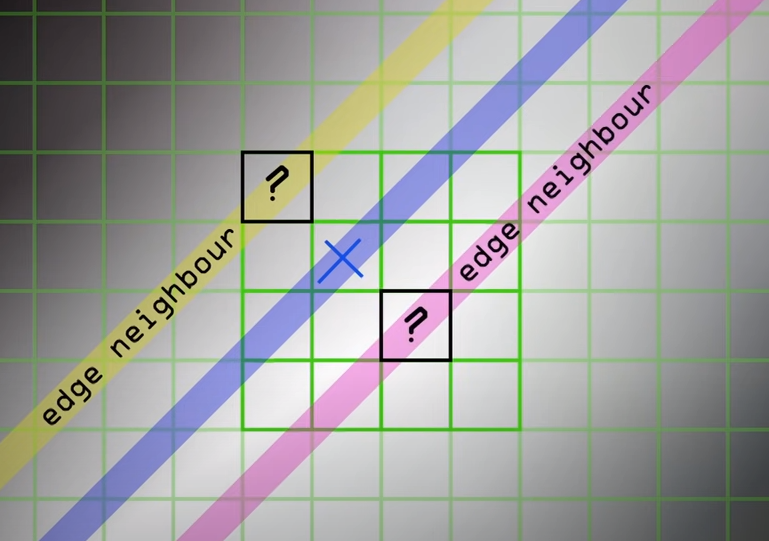
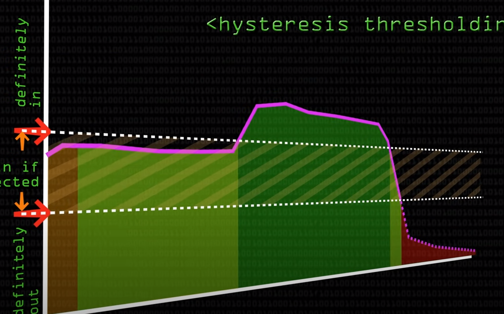

# Flipkart GRiD 3.0

- Functions

# Main Function
- Initialize botFinder
    - Initialize empty bot dict
    - Initialize pickup points
    - Initialize bot location
- Give points to wrap image (Frame caputed)
- Capture frame 
- Algin frame using `img_align`
- Feed image to BotFinder.give_frame(img)
- Get croped image using BotFinder.ret()
- Put text on each bot and and line for orientation 

# Classes

### BotFinder
- Variables
    | Varable | Defination |
    |- | -|
    |bot_ID_all|list of all bot_id available|
    |init1,init2|Pickup points|
- ret : returns dict of key as botID and value as (x,y,theta)
- give_frame
    - ExtractContour return array of croped images
    - Then each image is processed
    - Depending no it's new value of center it updates that botID's pose
        - Say current position of the detected bot is 1211,631
        - So for the existing bots it will find it's euler's distance is less then 50 it will be updated  

    ___

### ExtractContour
- Crop images and pose of all 4 bots and returns it an array
- Steps
    - Convert to HSV
    - purple mask
    - Morphologial Open
    - Blue
    - Morph Erode
    - Canny Edge
    - FindContour
    - For all the contours in detected contours
        - crop a bounding box
        - Append this bounding box to list of images
        - Get angle of orientation by feeding to angle class

    ---
    
### Angle

| Function | Defination   | Input |
| -------- | ------------ |-|
| init | Resize Image | image , times|
| orientation_line_from_angle | Draw Line | image, angle, center_coorinates| 
| min_dist | Euler Distance | coordiante_1, coordiante_2 |

- Init 
    - Find light source using hsv with high value in hsv
    - use findContour to get light value 
    - Take biggest contour to avoid noise
    - This will get us a dot 
    - find angle of dot by conneting it with the center of image
    - Draw a line from center to point found
- angle_b
    - get bot's orientaiton
- ret
    - return angle in range of [ `-pi` , `+pi` ]

    ---

# Functions

| Function | Defination   | Input |
| -------- | ------------ |-|
| size_mod | Resize Image | image , times|
| orientation_line_from_angle | Draw Line | image, angle, center_coorinates| 
| min_dist | Euler Distance | coordiante_1, coordiante_2 |
|img_align | Prespective Transfromation of image from points (a,b,c,d) to (a1,b1,c1,d1)  vertex of rectangle (Goto end for code) | image, inital points (a,b,c,d), final size of image height and width |


### imageAlign
 ```python
   def img_align(img,pts,size_x,size_y):
       img_gray = cv2.cvtColor(img,cv2.COLOR_BGR2RGB)
       rows,cols,ch = img_gray.shape
       pts1 = np.float32(pts)
       pts2 = np.float32([[0,0],[size_x,0],[size_x,size_y],[0,size_y]])
       # Get transform matrix 
       M = cv2.getPerspectiveTransform(pts1,pts2)
       # Crop matrix, multiply matrix, resize matrix
       dst = cv2.warpPerspective(img,M,(size_x,size_y))
       return dst
 ```

# Basic ImageProcessing theory

### Morphological Operation
- GreyScale 
    - Black - 0
    - White - 1
- Erode
    - White boundries to black
- Dilate
    - Black boundries to White
- Open : Remove noise
    - Erode and Dilate
- Close : Close hole
    - Dilate and Erode
- Gradient
    - Dilate - Erode
    ---
### Find Contour
``` python
cv.findContours(
    image, 
    mode, 
    method[, contours[, hierarchy[, offset]]]) 
    ->	
image, 
contours, 
hierarchy
```
> hierarchy : [ `Next`, `Previous`, `First_Child`, `Parent`]
- Mode
    - RETR_EXTERNAL : Only external contour 
    - RETR_LIST : All contour without relationnship
    - RETR_CCOMP : Two level hierarchy 
        - Say have 5 rect one inside other
        - named as from 1 to 5 with 1 as most external and 5 is most internal
        - So at hierarchy 
            1. 1,3,5
            2. 2,4
    - RETR_TREE : Proper hierarchy
    - RETR_FLOODFILL : `idk`
- Method : ContourApproximation
    - CHAIN_APPROX_NONE : No points skipped
    - CHAIN_APPROX_SIMPLE : points in vertial and horizontal line are skipped
        - So for a rectangle only 4 vertices will be stored 
    ---
### Canny Edge

- Based on Sobel Edge detector
    - In sobel edge each pixel is multiplied with a matrix like
    
        ||||
        |-|-|-|
        |-1|0|1|
        |-2|0|2|
        |-1|0|1|
    - So for each pixel if on its left and right intensities are differnt so this will result a non zero value
    - This is for vectical edge detection
    - Same goes for horizontal edge detecton
    - Say for a point from vertical edge we get a value and name it gradient_x (Gx) and for horizontal say gradient_y (Gy)
    - So for each pixel we have gradient as sqrt(Gx^2 + Gy^2) 
    - Now this output gradient is scaled to 0 to 255 on greyscale

- Canny Edge
    - It is based on sobel operator's output we have edge with it's direction 
    - based on direction we can check the neighbor and find the max value and eleminate others
    - in the image shown when comparing w.r.t to blue line yellow line will be eleminated or coverted to black
    <center>

    

    </center>
    - Now we have boundary of image as pixel intensitied from 0 to 255
    - So if we have a line in an image with pixel intensity on y-axis so we can perform hystresis thresolding
    - So we pick upper bound and lower bound
    - All the intensities over upper bound are reserved 
    - All the intensities between lower and upper bound are stored if are connected with upper bound 
    - And All below lower bound are discarded
    
    <center>

    

    </center>


# NumPy (Numerical Python)
- In python list are not stored in continous memeory 
- But numpy array (ndarray) are stored in continous memory
- This is called locality of reference, 
- Thats the reason why they are fast


